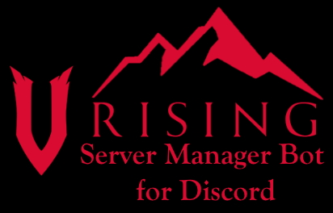

<!-- Improved compatibility of back to top link: See: https://github.com/othneildrew/Best-README-Template/pull/73 -->

 

  

  <h3 align="center">V Rising Dedicated Server Manager</h3>

<!-- ABOUT THE PROJECT -->

## About The Project

The reason I made this project is simple. I wanted to make a SteamCMD dedicated server on my old laptop and I wanted my friends to be able to start the server too. The easiest way was through a Discord server.

(<a href="#readme-top">back to top</a>)

 

<!-- TABLE OF CONTENTS -->

  
Table of Contents

  <ol>
    <li>
      <a href="#about-the-project">Built With</a>
      </ul>
    </li>
    <li>
      <a href="#getting-started">Getting Started</a>
      <ul>
        <li><a href="#installation">Installation</a></li>
      </ul>
    </li>
    <li><a href="#usage">Usage</a></li>
    <li><a href="#roadmap">Roadmap</a></li>
    <li><a href="#contributing">Contributing</a></li>
    <li><a href="#license">License</a></li>
    <li><a href="#contact">Contact</a></li>
  </ol>

#

## Built With

- Golang
- DiscordGo
- SteamCMD

(<a href="#readme-top">back to top</a>)

## Getting Started

Make sure you have setup a bot on the <a href="https://discord.com/developers/applications">Discord Dev Site</a> and have your Bot Token ready. Invite your bot by navigate to OAuth2 => URL Generator. Choose bot and in the second window: Send Messages, Manage Messages, Read Message History, Mention Everyone. Use generated link. Your bot should be now offline in your server.

 

### Installation

1. Open the .exe file and follow the steps
2. Have fun

(<a href="#readme-top">back to top</a>)

<!-- USAGE EXAMPLES -->

## Usage

You can use these commands to manage your Steamcmd Dedicated Server.

`!start`
Start the server.

`!stop_admin`
Stop the server. Not functional yet! Server has to be stopped manually + in the Discord Server !stop_admin has to be called. If not, the server can't be started again.

`!check`
Check if the server is already running.

`!install [game]`
Install a dedicated server for the preferred game. Right now only for V Rising Dedicated Server.

 

### Planned Commands

Some of the commands that are planned or in work. It is planned to manage every SteamCMD Dedicated Server that exists.

`!list [game]`
Search if server exists for game.

(<a href="#readme-top">back to top</a>)

<!-- ROADMAP -->

## Roadmap

- [x] Add README.md
- [x] Add back to top links
- [x] Add basic functionality (!start, !help, !check, !version)
- [ ] Add basic funtionality (!stop)
- [ ] Add funtionality for installing other server (!install)

See the [open issues](https://github.com/sohneg/steamcmd-manager-discord-bot/issues) for a full list of proposed features (and known issues).

(<a href="#readme-top">back to top</a>)

<!-- CONTRIBUTING -->

## Contributing

Contributions are what make the open source community such an amazing place to learn, inspire, and create. Any contributions you make are **greatly appreciated**.

If you have a suggestion that would make this better, please fork the repo and create a pull request. You can also simply open an issue with the tag "enhancement".
Don't forget to give the project a star! Thanks again!

1. Fork the Project
2. Create your Feature Branch
3. Commit your Changes
4. Push to the Branch
5. Open a Pull Request

(<a href="#readme-top">back to top</a>)

<!-- LICENSE -->

## License

See `LICENSE.txt` for more information.

 

<!-- CONTACT -->

## Contact

Project Link: [https://github.com/sohneg/steamcmd-manager-discord-bot]
